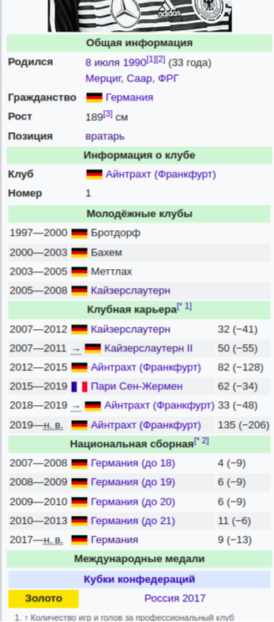
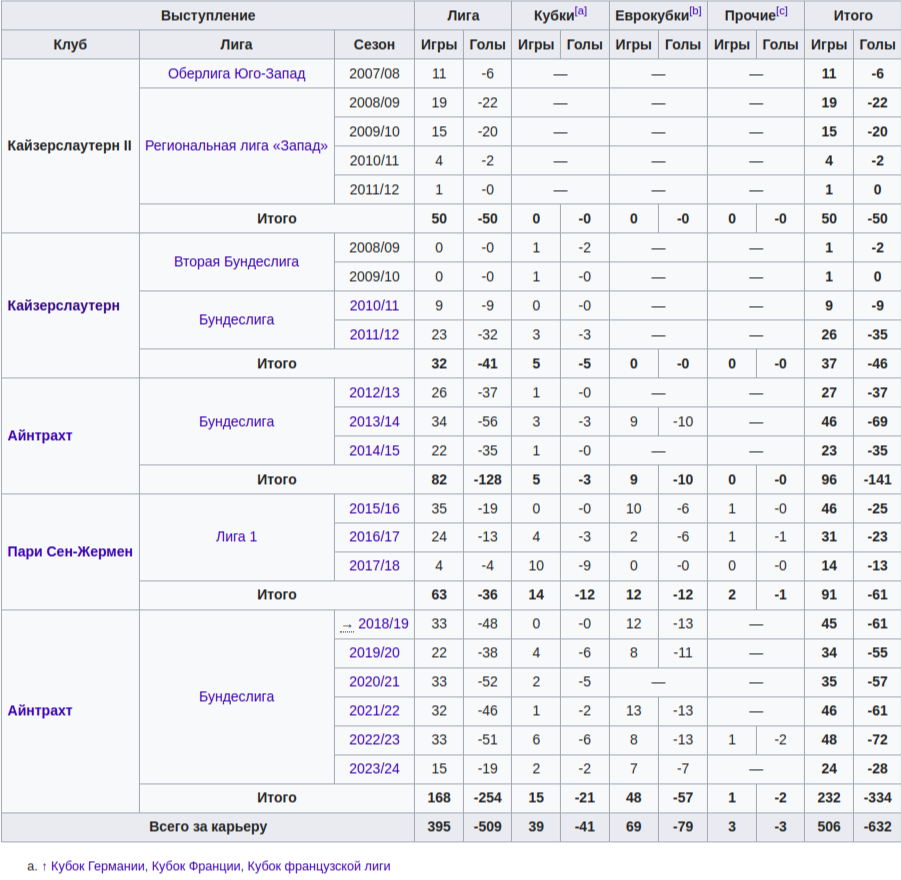

# Домашнее задание по скрейпингу

## Постановка задачи
Необходимо разработать программу для сбора информации по сборным-участницам чемпионата Европы по футболу 2024 путем скачивания некоторых html-страниц Википедии и их парсинга.
Программа должна запускаться bash-скриптом scripts/run.sh (сейчас там заглушка, надо доработать).
Этот скрипт должен принимать в качестве аргументов URL, с которого предполагается начать обход и путь до файла с результами.
Пример запуска:
```bash
./scripts/run.sh http://localhost/wiki/Чемпионат_Европы_по_футболу_2024 ./real_results/result.jsonl
```
Язык программирования - предпочтительно Python.

Запрещено использовать API Википедии, XML, SQL дампы и другие способы обойти требование парсить HTML:) Программа должна корректно обрабатывать внешние ошибки.

Подготовка окружения должна осуществляться скриптом scripts/prepare.sh (сейчас там установка библиотеки requests в venv, также надо доработать).

Результат сохранить в формате [jsonl](https://jsonlines.org/). Каждая строчка - информация об игроке из последнего созыва сборной-участницы.

Для каждого игрока надо сохранить следующее.
* URL страницы в википедии ("url").
* Имя ("name") - массив вида ["Фамилия", "Имя"].
* Рост ("height").
* Позиция на поле ("position").
* Текущий клуб ("current_club").
* Число игр за клубную карьеру ("club_caps").
* Число пропущенных голов за клубную карьеру ("club_conceded"). Заполняем только для вратарей, для полевых игроков - всегда 0.
* Число забитых голов за клубную карьеру ("club_scored"). Заполняем только для полевых игроков, для вратарей - всегда 0.
* Число игр за национальную сборную ("national_caps"). Рассматриваем только игры (с голами также) за взрослую команду (без учета всяких "сборная до 21" и т.п.).
* Число пропущенных голов за клубную карьеру ("national_conceded"). Заполняем только для вратарей, для полевых игроков - всегда 0.
* Число забитых голов за клубную карьеру ("national_scored").
* Национальная команда ("national_team").
* Таймстемп даты рождения в секундах ("birth"). Время надо парсить, считая, что оно в таймзоне UTC.

Пример:

```json
{
    "url": "http://localhost/wiki/%D0%A2%D1%80%D0%B0%D0%BF%D0%BF,_%D0%9A%D0%B5%D0%B2%D0%B8%D0%BD",
    "name": [
        "Трапп",
        "Кевин"
    ],
    "height": 189,
    "position": "вратарь",
    "current_club": "Айнтрахт (Франкфурт)",
    "club_caps": 506,
    "club_conceded": 632,
    "club_scored": 0,
    "national_caps": 9,
    "national_conceded": 13,
    "national_scored": 0,
    "national_team": "Сборная Германии по футболу",
    "birth": 647380800
}
```

Для некоторых полей (таких как national_scored, national_conceded и проч.) значения присутствуют в нескольких местах. Причем эти значения могут долго не обновляться. Предлагается брать наибольшее значение из найденных.
Пример разных вариантов для страницы [футболист](https://ru.wikipedia.org/wiki/%D0%A2%D1%80%D0%B0%D0%BF%D0%BF,_%D0%9A%D0%B5%D0%B2%D0%B8%D0%BD). Можно сложить числа выступлений за разные клубы, а можно взять результат из таблицы с детальной статистикой. Тут числа из детальной статистики больше, поэтому берем их.

| Блок справа             |  Детальная статистика внизу |
|-------------------------|-------------------------|
 | 


## Проверка
Необходимо
* пройти автоматизированную проверку. В этой проверке идет работа с локальной копией части википедии.
* скачать и распарсить реальный раздел википедии. Стартовая страница - [ЧЕ 2024](https://ru.wikipedia.org/wiki/%D0%A7%D0%B5%D0%BC%D0%BF%D0%B8%D0%BE%D0%BD%D0%B0%D1%82_%D0%95%D0%B2%D1%80%D0%BE%D0%BF%D1%8B_%D0%BF%D0%BE_%D1%84%D1%83%D1%82%D0%B1%D0%BE%D0%BB%D1%83_2024). Сохранить html-страницы в архиве `test_data/real/htmls.tar.gz`; результат парсинга в файле `test_data/real/result.jsonl`.
* Сохранить файл с отличиями между результатами парсинга локальной копии википедии и реального раздела (`test_data/real/result.jsonl` и `test_data/local/result.jsonl`). Надо вывести каких игроков не оказалось в реальном разделе из локального варианта, какие добавились, игрока с наибольшей разницей забитых голов.
* представить код на проверку через pull request. Просьба прежде чем создавать PR убедиться, что разработанная программа работает локально.
